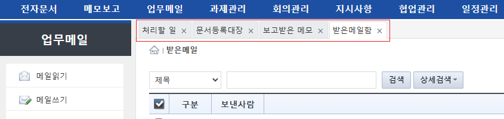
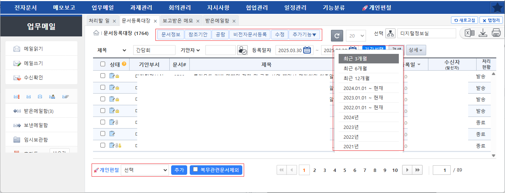
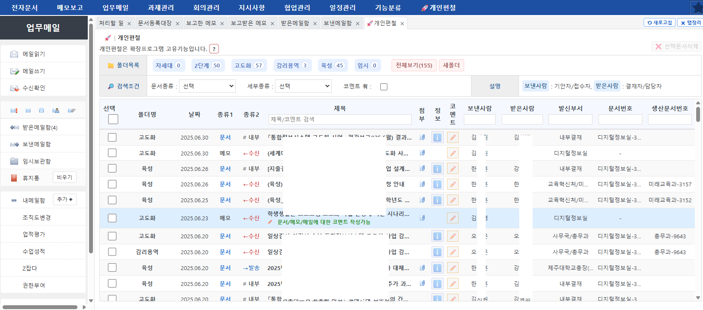
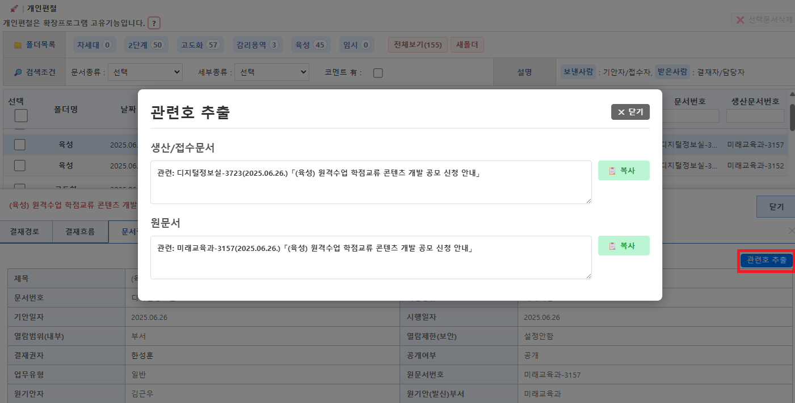

# KoEx(코익스)
**코익스**는 국립대학자원관리시스템(코러스)의 업무관리(전자결재)에 대한 크롬확장프로그램(Extention)입니다.
코러스 업무관리 사중중 불편한 점을 확장프로그램을 통하여 편리하게 사용할 목적으로 제작되었습니다.

# 😖 코러스 업무관리 대표적인 불편사항
* **탭기능 부재**
  - 작업중 다른 메뉴로 이동시 기존 작업화면이 유지되지 않았습니다.
* **문서검색 불편**
  - 문서등록대장에서 검색시 등록일자(시작일/종료일)설정이 어려웠습니다. ex. 최근 5년 "간담회" 키워드로 검색시 달력컴포넌트에서 "연도/월/일"을 매우 여러번 설정해야함
  - 최근 1년 문서만 검색가능 (성능 때문이기도 하겠지만 이 때문에서 검색기간 설정이 어려움)
  - 탭기능이 없기때문에 검색중 다른 화면 전환후 이어서 검색할 수 없음.
  - 즐겨찾기 기능이 있지만 기능이 제한적이어서 사용할 수 없음.
* **즐겨찾기 불편**
  - 즐겨찾기 기능이 있지만 관리항목(컬럼)이 작고
  - 여러 문서를 선택하여 즐겨찾기에 추가할 때 이미 즐겨찾기 추가된 항목이 한개라도 있는 경우 오류발생 후 기능이 중단됨
  - 보낸 메모인지 받은 메모인지 식별 불가
  - 업무메일은 즐겨찾기로 관리 불가
  - 즐겨찾기 된 문서의 열람은 메인화면의 별표를 클릭하여 볼 수 있으나 추가 할때는 "추가기능" 콤보버튼 클릭 후 즐겨찾기를 해야함
  - 문서/메모보고 외 로컬파일을 등록할 수 있는 기능은 좋지만 제목지정이나 기타 정보는 등록할 수 없고 파일명이 제목으로 자동 등록됨(사실상 이용불가)
  - 이러한 이유로 즐겨찾기 기능은 있지만 실제 사용되기 어려움
* **처리할일**
  - 상단에 각 항목별(결재대개, 발송대기 ... )로 건수가 표시되고, 아래로 각 항목별(8개 항목)로 목록이 출력됨
  - 각 항목별로 처리건수가 "0"건인 항목들도 나열되어 화면이 복잡함

# ✨ 코익스에서 제공하는 기능
* **탭기능 제공**
 
     
  - 모든 메뉴클릭시 탭으로 열리기 때문에 기존 작업화면이 유지됩니다.
  - 생성된 탭에 대한 기본동작(생성, 닫기, 탭정리, 순서변경)을 제공합니다.
  - 기존 작업화면이 유지되는 대신 필요에 따라 탭 새로고침이 필요합니다.
  
* **문서등록대장 기능개선**
  
  
  - 쉬운 검색기간 설정 : 시작 ~ 종료일자 선택쉽게 선택. 연/월/일을 세부적으로 선택하지 않아도 됩니다. 검색키워드 입력시 최근 3년(+알파)기간을 한번에 검색가능합니다. (1년 이상에 대한 검색은 코러스 서버정책에 의하여 차단될 수 있습니다.)
  - 버튼위치 조정으로 작은창으로도 작업이 가능합니다. 기존 [문서정보]~[추가적보]버튼이 길게 가로로 배치된것을 남는 공간을 활용하여 2줄로 표시함(200px정도 작어져도 작업가능)
  - 복무관련 문서를 목록에서 제외할 수 있습니다. 가끔 문서목록에 "근무상황신청" 또는 "초과근무신청" 문서만 한가득인 경우가 있습니다.

* **개인편철 기능**

   
  과제카드는 개인화되어 있지않고 부서별 기준에 의하여 일률적으로 관리됩니다. 문서/메모/메일에 대한 분류는 업무담당자의 목적에 따라 분류될 수 있으면 좋겠지만 코러스에서는 관련 기능을 제공하지 않습니다. 코익스에서 제공하는 개인편철 기능은 이러한 불편사항을 제공하기 위한 기능을 제공하지만 완벽하지는 않습니다.
   - 기존 즐겨찾기 기능과는 별개의 기능임 (확장프로그램으로는 기존 즐겨찾기 기능을 확장하기 불가)
   - 문서/메모(보낸/받은)/메일(보낸/받은) 에 대하여 개인편철 가능
   - 폴더를 생성하고 해당 폴더에 문서/메모/메일을 편철 할 수 있음
   - 이미 추가된 항목(중복)이 있더라도 해당 항목만 skip되고 나머지는 추가가능
   - 폴더명, 종료(문서/메모/메일), 발송/수신, 제목 등 다양한 검색조건 제공
   - 각 문서에 코멘트 작성가능. ex. 코멘트로 각 문서의 미비사항, 향후추진, 지시사항 등 관리가능
   > 개인편철의 저장소 : 확장프로그램에서 업무메일의 임시보관함에 저장소를 생성하여 내부적으로 관리. 임시보관함에서 해당 메일을 삭제할 경우 기존 관리하던 개인편철이 삭제됨을 주의할것!!!

* **관련호 추출 기능**

  
  - 우리는 통상 문서작성을 위하여 [기안] - [전체서식] - [기안문1] 메뉴를 순서대로 접근하여 기안기를 실행합니다.
  - 기안기가 실행된 후 생각합니다. "맞다!!! 관련호를 입력해야 하는데~~~". 관련호를 찾아 해당문서를 실행합니다.
  - 해당 문서는 읽기전용이어서 제목을 복붙하기도 어렵고하여 여러가지 방법을 통하여 관련호를 메모장에 임시로 작성하거나 합니다.
  - 코익스에서는 이러한 불편사항을 해결하기 위하여 관련호 추출기능을 제공합니다.
  - 문서등록대장 또는 개인편철에서 문서정보를 확인하는 부분에 **관련호추출** 버튼을 클릭하면 해당문서의 관련호를 클립보드로 복사합니다.
 

* **처리할일**
  - 처리할일 탭에서 각 건수들의 폭이(width) 적당한 폭으로 출력되며
  - 하단 각 항목별 목록은 처리 건수가 있는 항목만 출력되어 확인이 용이 합니다.

# 코익스 사용에 대하여
   - 코익스는 코러스에서 공식적으로 제공하는 서비스가 아닙니다. (문제 발생시 코러스운영센터로 연락하시면 안되요)
   - 동작하던 기능이 갑자기 동작하지 않을 수 있습니다. (브라우저 이슈, 코러스서비스 변경)
   - 코익스는 코러스 기반하에 할 수 있는 범위에서 기능을 확장한 것으로 이외의 기능 추가는 사실상 어렵습니다.
   - 코익스 확장프로그램은 코러스 접속가능환경에서만 동작하며, 개인정보 또는 특별히 보안적으로 비공개되어야 할 기술을 사용하지 않습니다.
   - 향후 코러스 기능개선시(차세대?) 탭기능 및 문서검색, 개인편철 기능은 가능한 추가되었으면 하는 바랍니다.
   - 문제발생시 aawoon@jejunu.ac.kr로 메일 주시면 가능한 대처는 하겠습니다. (개인이 관리하는 프로젝트라서 대응이 느릴 수 있습니다.)
   - 지속적인 문제 발생시 플러그인 사용을 중단하세요.
   

# 코익스 설치방법
  코익스는 크롬 웹 스토어에 비공개로 등록되어있습니다.
  - 설치주소 : 🔗 [https://chromewebstore.google.com/detail/kcjeomjhmicgklegchgdfafpbjopabmc?utm_source=item-share-cb](https://chromewebstore.google.com/detail/kcjeomjhmicgklegchgdfafpbjopabmc?utm_source=item-share-cb)

# 플러그인 삭제방법
  [크롬메뉴] - [확장프로그램] - [확장프로그램관리] - [코익스] 확장프로그램 삭제
